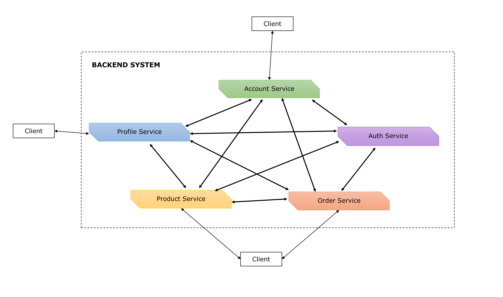

MicroFleet — A container-friendly microservice framework written in TypeScript.
====
Lets you develop a microservice system using transferable knowledge (such as Dependency Injection, RPC, ORM, DTO, Model auto mapping, Repository pattern, Domain-driven design etc.), because we know that services in a microservice system can be written in different languages (C#, Java, Golang...).

Various architectures
----

MicroFleet doesn't enforce any architecture design, here are just some examples:

## All-RESTful architecture (unstandard name)



A lot of you may be familiar with this architecture, especially those who are new to microservice. In this architecture, all services are RESTful, accept requests from clients, and communicate via HTTP calls.


## Backend-for-frontend (BFF) services and Domain services

 services and Domain services")

Another popular architecture, we have REST service accepting clients' requests and passing them to message queue / message broker. Internal domain services pick queued requests to process then send reponses back to message broker for the caller REST service to receive and respond to client.

Notice that we also have direct communication between services, in addition to mediate communication via message broker.

For the sake of brevity, we don't mention any more architectures here. You can always create an issue if you have problem with applying MicroFleet.

Similar code interfaces
----
Building various architectures with similar code interfaces.

Regardless you are developing RESTful service, domain service, or batch processing, monitoring, logging service... MicroFleet helps keeping the way you code mostly the same. Let's have a look:

### RESTful service's controller

```typescript
import { inject } from '@micro-fleet/common'
import { decorators as d } from '@micro-fleet/web'

@d.controller('accounts')
export default class AccountController {

	@d.GET('/:id')
	public details() {
		// Make RPC request via broker topic "request.accounts.getDetails"
		return // Returned value to client-side
	}
}

```

### Domain service's controller

This controller listens to mediate RPC requests, and at the same time it also accepts direct RPC requests.

```typescript
import { inject } from '@micro-fleet/common'
import { decorators as d } from '@micro-fleet/service-communication'

@d.mediateController('accounts')
@d.directController('accounts')
export default class AccountController {

	@d.action('getDetails')
	public details() {
		// Does heavy-duty task here
		// Returns value to RPC caller via broker topic "response.accounts.getDetails"
		return 'Account details'
	}
}

```

### Monitoring / Logging service

This controller listens to mediate RPC communication among other services for monitoring / logging purpose.

```typescript
import { inject } from '@micro-fleet/common'
import { decorators as d } from '@micro-fleet/service-communication'

@d.mediateController('accounts')
export default class MonitorController {

	@d.action({ rawDest: 'request.accounts.*' })
	public monitor() {
		// Receives all requests related to "accounts"
	}
}

```

Interested yet? Let's really get started!
----

Firstly, grabbing some [concepts](./docs/concepts/README.md) will be helpfull before you jump to code.

Micro Fleet is written in TypeScript, but you can develop with native JavaScript. Our [cookbook] will offer both TypeScript and JavaScript version.

## Contribute

To start developing, these commands need executing:
  * Install global dependencies:
    - `npm i -g`
    - or `yarn global add lerna`
  * Install dependencies:
    - Make sure you have `cd` to the workspace root.
    - `lerna bootstrap`

### How This Project Was Initialized

In case you want to start a new monorepo like this one. This project structure is inspired from [lerna-yarn-workspaces-example](https://github.com/Quramy/lerna-yarn-workspaces-example) but added some customizations:

* Use `independent` mode of [lerna](https://github.com/lerna/lerna)
* The major task runner is NPM, with `scripts` section in `package.json`, as inspired from [how-to-use-npm-as-a-build-tool](https://www.keithcirkel.co.uk/how-to-use-npm-as-a-build-tool/)

