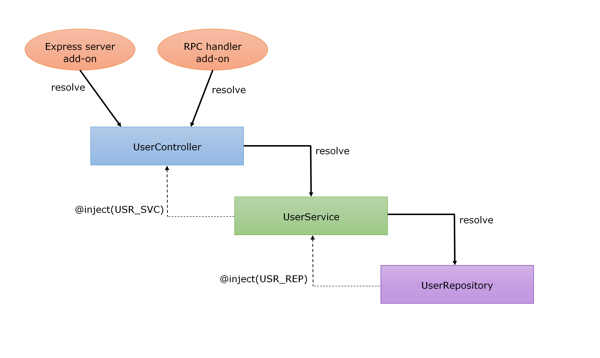

# Dependency injection (DI)

Keep in mind that the base service is like a tree trunk, while [add-ons](./service-add-on.md) are tree branches. 

The code in your [add-ons](./service-add-on.md) may want to use some features from other add-ons, and even from the service trunk. In order to avoid spaghetti connections amongst them, we leverage dependency injection to decouple them.

## Dependency Container (DC)

One Dependency Container instance is shared within the whole service. We can access it by 03 ways:

- Via the protected property `this._depContainer` that your service instance inherits from `MicroServiceBase`.

    ```typescript
    class App extends MicroServiceBase {

        /**
         * @override
         */
        protected registerDependencies(): void {
            super.registerDependencies() // Don't forget this

            // Register
            this._depContainer.bind(..., ...)

            // Resolve
            const obj = this._depContainer.resolve(...)
        }
    }
    ```

- Via DI, the DC registers itself as a dependency, so you can easily inject it to your class. This is common technique used by service add-on.

    ```typescript
    import {
        inject, IDependencyContainer, Types as CmT,
    } from '@micro-fleet/common'

    export class MyAddOn {
        constructor(
            @inject(CmT.DEPENDENCY_CONTAINER) dc: IDependencyContainer,
        ) {
        }
    ```


- Via global singleton `serviceContext`. This way is not recommended to use in casual cases except when you encounter really unique situation.

    ```typescript
    import { serviceContext as scx } from '@micro-fleet/common'

    export class UserLogic {
        public getList(): Promise<User[]> {
            // Beware! NOT recommended way
            const usrRepo = scx.dependencyContainer.resolve(USER_REPO)
            return usrRepo.fetchAll()
        }
    }
    ```

## Register dependency

In static-typed languages, a dependency registry includes an interface mapped to a class implementing that interface. Later on, the interface is used to retrieved the mapped class.

However, NodeJS a dynamic-typed, TypeScript interface will disappear when the code is transpiled, so our dependency registry includes an identifier (of type string or ES6 Symbol) mapped to a value of arbitrary type. We will use the identifier to resolve the mapped value.

The right place to register dependencies is to override `registerDependencies()` method, which is called before `onStarting` event of the [starting flow](./service-lifecycle.md#starting-flow). Because add-on initialization phase will need to resolve those dependencies.

```typescript
/*
 * File name: /constants/Types.ts
 */
export enum Types {
    USER_REPO = 'microfleet:persistence:IEventRepository',
    ROLE_REPO = 'microfleet:persistence:RoleRepository',
    VAT_CONST = 'microfleet:constants:vat',
```

```typescript
/*
 * File name: /App.ts
 */
import { Types as T } from './constants/Types'
// import IUserRepository, UserRepository, IRoleRepository and RoleRepository

class App extends MicroServiceBase {

    /**
     * @override
     */
    protected registerDependencies(): void {
        super.registerDependencies() // Don't forget this

        // The interface here just for type checking,
        // TypeScript compiler will make sure class UserRepository
        // implements interface IUserRepository.
        this._depContainer.bind<IUserRepository>(T.USER_REPO, UserRepository)

        // Register as singleton
        // Everytime you resolve this dependency, you always get the same instance.
        this._depContainer
            .bind(T.ROLE_REPO, RoleRepository) // No interface for type checking
            .asSingleton()

        // Binding an object as constants is always singleton
        this._depContainer.bindConstant(T.ROLE_REPO, new RoleRepository())

        this._depContainer.bindConstant(T.VAT_CONST, 0.3)
    }

}
```

The registered class must have `@injectable()` decorator.

If your class extends another class, all the classed up the hierarchy must be decorated too.

If you inherits from a 3rd-party class that you cannot change the source code, you can use helper function `decorate()`

```typescript
import { injectable, decorate } from '@micro-fleet/common'
import { Ancestor } from 'external-lib'

decorate(injectable(), Ancestor)

@injectable()
export abstract class RepositoryBase
    extends Ancestor {
    ...
}

@injectable()
export class UserRepository
    extends RepositoryBase
    implements IUserRepository {

    public getList(): Promise<User[]> {
        ...
    }
}
```

The underlying DI engine is ["inversify"](http://inversify.io/) library. You can read its docs about other rules like resolving singleton instance, unmanaged parameters etc.

## Resolve dependencies

Later in your code, you have many ways to resolve the dependencies:

- Via <a name="automatically-resolved">automatically-resolved constructor parameter</a>, this is the RECOMMENDED way. However the class must be also registered to DC. This topic is covered in depth in a section [Resolve hierarchical dependencies chain](#resolve-hierarchical-dependencies-chain):

    ```typescript
    import { inject, injectable } from '@micro-fleet/common'

    @injectable()
    export class UserLogic {
        constructor(
            @inject(USER_REPO) private _userRepo: IUserRepository,
        ) {
        }

        public getList(): Promise<User[]> {
            return this._usrRepo.fetchAll()
        }
    }
    ```

- Via <a name="lazily-resolved">lazily-resolved property</a> decorated with `@lazyInject()`. The class doesn't need to be registered to DC.

    ```typescript
    import { lazyInject } from '@micro-fleet/common'

    export class UserProvider {

        @lazyInject(IDENTIFIER) // <= lazy injection
        private _helper: Helper

        public doSomething(): void {
            this._helper.assist()
        }
    }
    ```

    This way is the least performant, as it resolves the dependency _everytime_ the property is accessed. But it is useful in some rare cases, for example to avoid circular dependency.

    ```typescript
    /*
     * File name: Types.ts
     */
    export const Types = {
        TOME: Symbol(),
        JERRY: Symbol(),
    }
    ```

    ```typescript
    /*
     * File name: Tom.ts
     */
    import { inject, injectable } from '@micro-fleet/common'
    import { Types as T } from './Types'
    import { Jerry } from './Jerry'

    @injectable()
    export class Tom {
        constructor(
            @inject(T.JERRY) mouse: Jerry,
        ) {
        }
    }
    ```

    ```typescript
    /*
     * File name: Jerry.ts
     */
    import { lazyInject, injectable } from '@micro-fleet/common'
    import { Types as T } from './Types'

    // No! Doing this will cause circular reference.
    // import { Tom } from './Tom'

    @injectable()
    export class Jerry {

        @lazyInject(T.TOM) // <= lazy injection
        private _cat: import('./Tom').Tom,

        public run(): void {
            // Tom instance is resolved *everytime* this._cat is accessed.
            console.log(`Running away from ${this._cat.name}`)
        }
    }
    ```

- When all above cannot solve your problem, you can access global DC instance as the last resort.

```typescript
import { serviceContext as scx } from '@micro-fleet/common'

class UserLogic {
    public getList(): Promise<User[]> {
        // Beware! NOT recommended way, only for difficult situations.
        const usrRepo = scx.dependencyContainer.resolve<IUserRepository>(USER_REPO)
        return usrRepo.fetchAll()
    }
}
```

Again, it is advisable to read ["inversify"](http://inversify.io/) documentation to understand the mechanism.

## Resolve hierarchical dependencies chain

As said above, the prefered technique is [automatically-resolved constructor parameter](#automatically-resolved). When you want to resolve a dependency, but it depends on another one which in turn depends on another one. This forms a hierarchical dependencies chain. This situation is so popular when working with DI that all DCs support resolving this kind of chain.



Looking at the diagram, we see from the bottom up that `UserRepository` is injected to `UserService`'s constructor. Then `UserService` is injected to `UserController`'s constructor.

When the DC is asked to resolve an instance of `UserController`, it must resolve `UserService`, in order to do that, it must resolve `UserRepository`. Moreover, these class may have more dependencies injected to constructor but we just keep it simple in this example.

The whole resolving chain is triggered from top down when you try to resolve `UserController`. The big question is: _"WHO ASKS TO RESOLVE `UserController`?"_.

Well, to start the automatic chain, we need to manually call `serviceContext.dependencyContainer.resolve(...)`, but we don't let you do it yourself, we do that internally in the Express server add-on and RPC handler add-ons.

In conclusion, you just have to [_register the dependencies_](#register-dependency) then _ask_ for instances of them with `@inject()` decorator. Don't worry about how to resolve them.

Read the [Service Communication](./service-communication.md) page for more about Express server add-on and RPC handler add-ons.