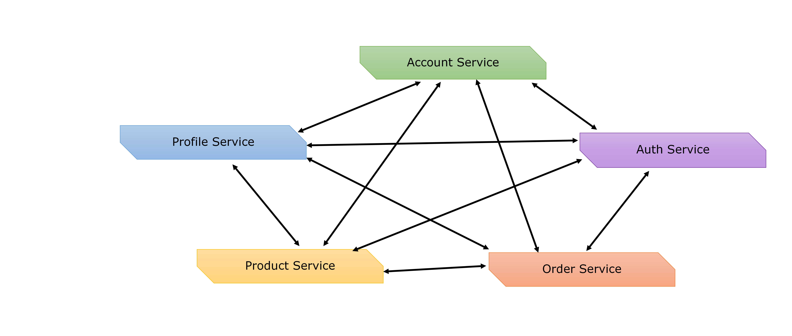
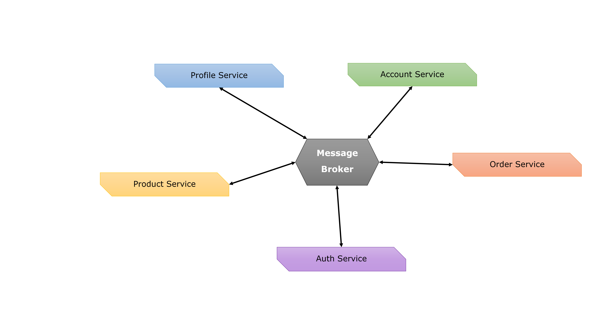
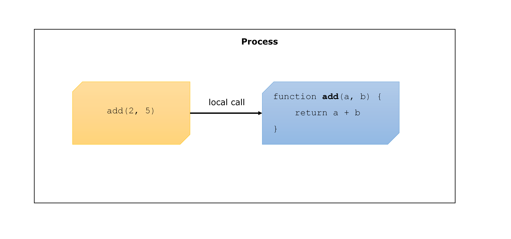
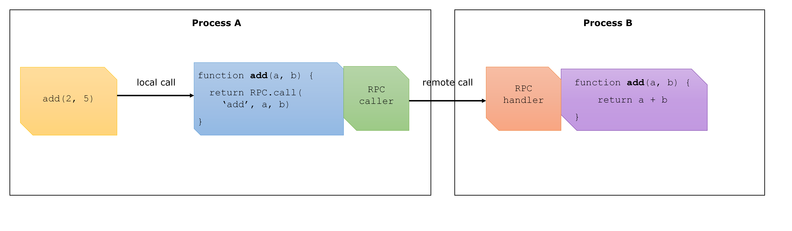

# **Service Communication**

Service discovery and communication is a headache in microservice world. Micro Fleet simplifies it for you by providing object-oriented RPC abstraction.

## **Accepting incoming requests/messages**

Micro Fleet supports 03 ways to accept incomming requests: HTTP(S) server, Direct RPC handler, Mediate RPC handler.

### **HTTP(S) server for external communication**

This should be used for RESTful gateway service accepting HTTP(S) requests from clients like web browser or mobile app. This kind of service belongs to "back-end for front-end (BFF) layer".

Advantages:
* Popular protocol (HTTP v1) which is widely supported by various client apps.
* Easy to implement

Disadvantages:
* Popular protocol may be stuck with old version for a long time.
* Hard to upgrade to latest technologies with better security and performance, because they are not widely supported by client apps.

### **Direct internal communication**

This should be used for communication between internal services, where a service connects directly to another one. When the number of services is plenty, it will cause a connection mesh.



Advantages:
* Fast
* Suitable for features which requires low latency, for example: Authentication Service which decodes JWT token; Id Generation Service which generates sequential Id numbers.
* Controlled technology. Since this kind of communication is for internal use, we can choose the latest technology like HTTP2 (with binary protocol) for best performance.

Disadvantages:
* Each source service must have a mechanism to discover the addresses of all target services that it wants to communicate.
* In case first attempt to send request fails, the source service must have a mechanism to discover the address of an alternative target service and re-send the request to the newly found one. This just repeats if the second target service is down.

### **Mediate communication**

This can be used for communication amongst internal services as well as amongst external services and internal ones. To avoid connection mesh, we introduce a message broker that receives a message from a service then delivers the message to one or many other services.



Advantages:
* Reduce complexity, each service just has to maintain one connection to the Message Broker.
* If there are more messages than the processing capacity of a service, they will be kept in message queue and the service will pick one by one to process.
* We can expose message broker port for external services to connect, without the need to expose all internal service ports

Disadvantages:
* The Message Broker becomes a single point of failure. If it is down, the communication between services will be lost.
* Slower than direct communication.

## **Remote procedure call (RPC)**

RPC means calling a procedure/function/method from different processes.

To understand RPC, firstly let's look at a local call:



This is just a simple normal function call: the user invokes the function, the function implementation is executed then returns the result.

Now here is the remote call:



The function `add()` in Process A just provides the user with a familiar interface, it doesn't have the actual implementation, but delegates the parameters to the RPC Framework, which invokes the function in Process B then brings the result all the way back to the caller.

RPC Caller and RPC Handler belong to RPC Framework. The most popular frameworks at the moment are [gRPC](https://grpc.io/) developed by Google and [Apache Thrift](https://thrift.apache.org/).

There are many options to establish communication between RPC Caller in Process A and RPC Handler in Process B. If they are in the same computer, we can use IPC (Inter-process communication). In case they are not, the easiest way is Web API via HTTP, where RPC Caller is the HTTP client, and RPC Handler is HTTP server exposing API endpoints. "gRPC" uses this method via HTTP v2.

Micro Fleet RPC Caller and RPC Handler have 02 ways to establish connection:

* _Direct communication_: Currently we use Web API via HTTP v1, but soon will switch to "gRPC" with HTTP v2.
* _Mediate communication_: Via [RabbitMQ](https://www.rabbitmq.com/) message broker.

## **Micro Fleet RPC = RPC + DI**

Previously, we learnt about how RPC works in general. Now we look at how Micro Fleet RPC works with [Dependency Injection](./dependency-injection.md).


At a glance, you can easily recognize the pattern of a Micro Fleet service, either it is BFF service or internal one:

* Accepting incoming messages with controller classes.
* Controller class is injected with dependencies which may depend on other dependencies. It forms a [Hierarchical dependencies chain](./dependency-injection.md#resolve-hierarchical-dependencies-chain).

Now look closely at `UserController` in _Service A_, it invokes method `getList()` of interface `IUserProvider`, it doesn't care about the concrete class behind this interface. All it knows is calling `IUserProvider.getList()` will yield an array of users, or empty array.

In microservice system, we inject `RemoteUserProvider` in _service A_ to delegate the real working burden to _service B_. However if one day you are bored of microservice and want to switch back to monolith service, all you have to do is changing ONE (01) line of code in _service A_.

```typescript
protected registerDependencies(): void {
    super.registerDependencies()

    // For microservice
    this._depContainer.bind<IUserProvider(IDENTIFIER, RemoteUserProvider)

    // For monolith service
    this._depContainer.bind<IUserProvider(IDENTIFIER, UserProvider)
}
```

Then the service structure would look like this:


In both cases, there is no need to change the code of class `UserController` in _Service A_. All it knows is calling `IUserProvider.getList()` will yield an array of users, or empty array.

### **Example of Micro Fleet RPC**

* `IdProvider` (package [@micro-fleet/id-generator](https://github.com/gennovative/micro-fleet-id-generator)) will call a remote Id Generator Service if it finds the connection details in configuration. Otherwise it generates IDs locally. The caller never knows the difference.

* `CacheProvider` (package [@micro-fleet/cache](https://github.com/gennovative/micro-fleet-cache)) will read/write data from/to Redis service/cluster if it finds the connection details in configuration. Otherwise it stores data in local memory. The caller never knows the difference.

## **Service discovery**

At the moment, Micro Fleet service is designed to work in Docker container, and deployed in Docker Swarm or Kubernetes which handles service discovery. So there is no prebuilt add-on for this feature.

However you can always create a custom [add-on doing that job](./service-add-on.md#how-do-i-create-add-on-myself).